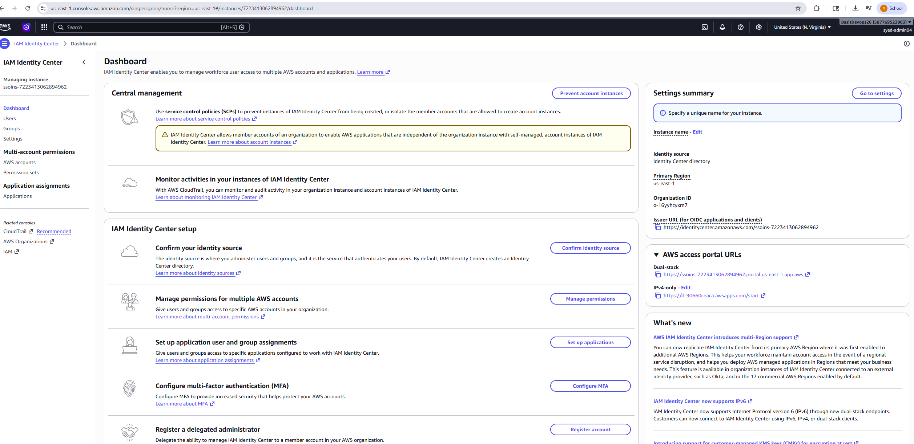
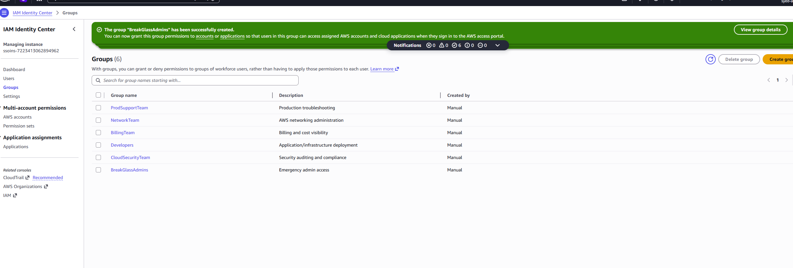
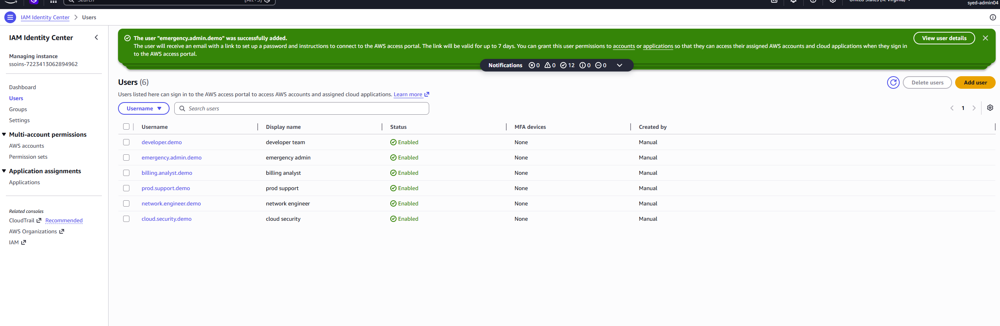
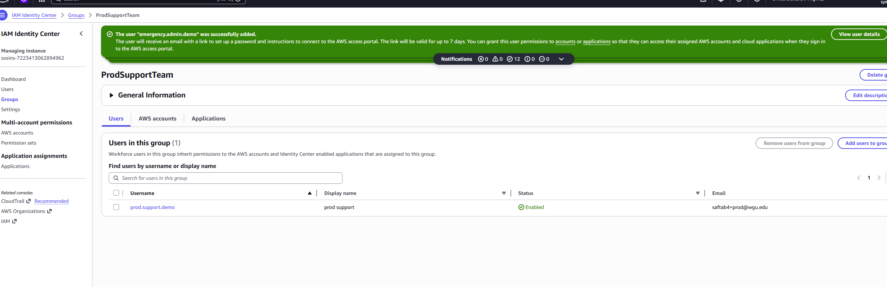
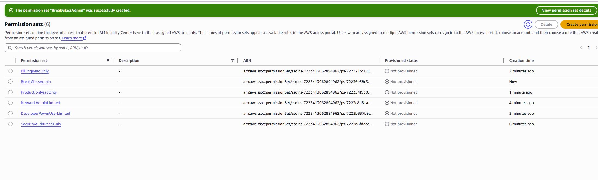
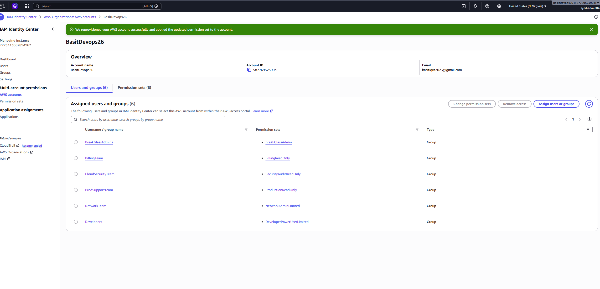
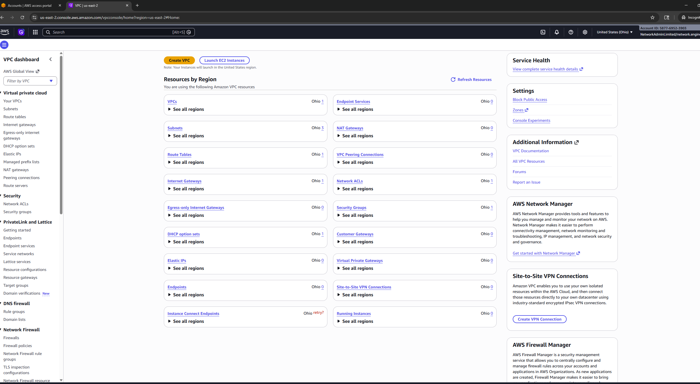
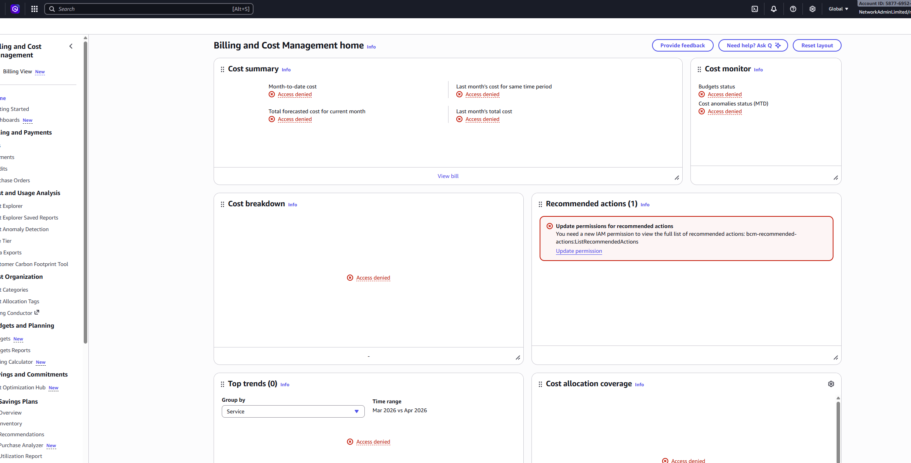
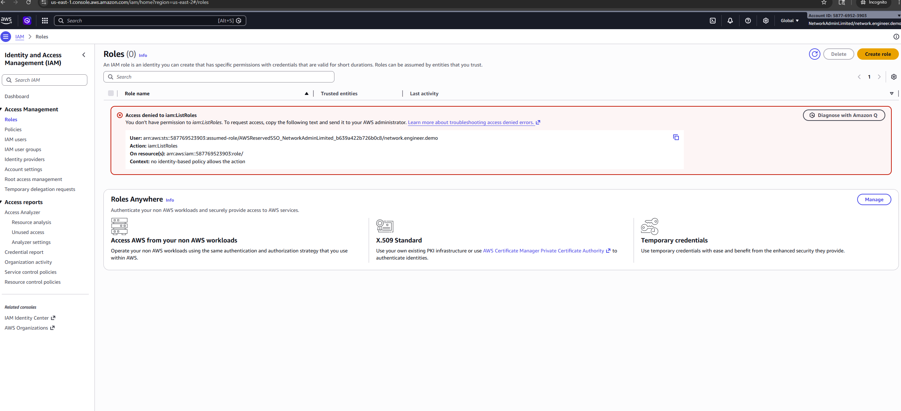
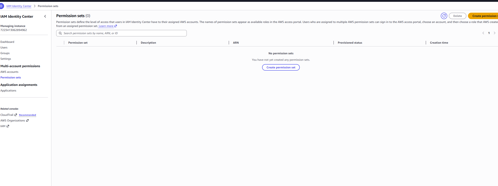

# Enterprise AWS IAM Identity Center RBAC Governance Lab

## Project Overview

This project demonstrates an enterprise-grade Role-Based Access Control (RBAC) implementation using AWS IAM Identity Center (formerly AWS SSO).

The lab simulates how real organizations centrally manage workforce identities, enforce least privilege access, and provide federated access to AWS resources without creating long-term IAM users.

The environment was intentionally designed using a single AWS account to simulate enterprise governance while avoiding unnecessary cost, complexity, and persistent infrastructure.

---

# Business Problem

In traditional AWS environments, organizations often create multiple IAM users with broad permissions directly inside AWS accounts.

This creates several security and operational challenges:

* Excessive permissions
* Difficult onboarding and offboarding
* Poor visibility into access control
* Long-term credentials exposure
* Weak governance and auditing
* Lack of centralized identity management

Enterprise organizations solve this by implementing:

* Centralized authentication
* Role-Based Access Control (RBAC)
* Federated temporary access
* Least privilege enforcement
* Permission scoping
* Group-based authorization

This project demonstrates those concepts using AWS IAM Identity Center.

---

# Objectives

The primary goals of this project were:

* Implement enterprise RBAC using IAM Identity Center
* Create workforce-style users and groups
* Build permission sets aligned to job functions
* Enforce least privilege access
* Validate allowed and denied permissions
* Simulate real enterprise identity governance
* Demonstrate centralized federated access management
* Document proper cleanup and governance procedures

---

# Architecture Overview

```text
Enterprise Workforce User
            │
            ▼
AWS IAM Identity Center
            │
            ▼
Enterprise Groups
            │
            ▼
Permission Sets
            │
            ▼
Federated Temporary AWS Access
            │
            ▼
Least Privilege Enforcement
```

---

# AWS Services Used

| Service                 | Purpose                                   |
| ----------------------- | ----------------------------------------- |
| AWS IAM Identity Center | Centralized workforce identity management |
| IAM Policies            | Permission control                        |
| Permission Sets         | Federated role assignment                 |
| AWS Managed Policies    | Enterprise access management              |
| AWS Console Federation  | Temporary federated access                |

---

# Enterprise Group Design

The following enterprise groups were created to simulate real organizational departments.

| Group Name        | Purpose                                     |
| ----------------- | ------------------------------------------- |
| CloudSecurityTeam | Security auditing and compliance visibility |
| NetworkTeam       | AWS networking administration               |
| Developers        | Application and infrastructure deployment   |
| BillingTeam       | Billing and cost visibility                 |
| ProdSupportTeam   | Production troubleshooting access           |
| BreakGlassAdmins  | Emergency administrative access             |

---

# Enterprise User Design

The following workforce users were created and mapped to corresponding groups.

| User                  | Assigned Group    |
| --------------------- | ----------------- |
| cloud.security.demo   | CloudSecurityTeam |
| network.engineer.demo | NetworkTeam       |
| developer.demo        | Developers        |
| billing.analyst.demo  | BillingTeam       |
| prod.support.demo     | ProdSupportTeam   |
| emergency.admin.demo  | BreakGlassAdmins  |

---

# Permission Set Design

Enterprise permission sets were created to align access with business responsibilities.

## 1. SecurityAuditReadOnly

Attached Policies:

* SecurityAudit
* ReadOnlyAccess

Purpose:

Provides security teams visibility into:

* CloudTrail
* IAM configuration
* Security metadata
* Compliance visibility
* Audit review

while preventing infrastructure modification.

---

## 2. NetworkAdminLimited

Attached Policies:

* NetworkAdministrator

Purpose:

Provides networking teams access to:

* VPC
* Route tables
* VPN
* Transit Gateway
* Security Groups
* Networking resources

while restricting billing and IAM governance access.

---

## 3. DeveloperPowerUserLimited

Attached Policies:

* PowerUserAccess

Purpose:

Allows developers broad AWS service access while preventing identity and governance administration.

---

## 4. BillingReadOnly

Attached Policies:

* Billing
* ReadOnlyAccess

Purpose:

Provides finance and billing teams visibility into:

* AWS billing
* Cost Explorer
* Budgets
* Usage analysis

without allowing infrastructure modification.

---

## 5. ProductionReadOnly

Attached Policies:

* ReadOnlyAccess

Purpose:

Provides production support teams read-only troubleshooting access for:

* Monitoring
* Log review
* Infrastructure visibility
* Resource inspection

---

## 6. BreakGlassAdmin

Attached Policies:

* AdministratorAccess

Purpose:

Provides emergency administrative access during:

* outages
* critical incidents
* recovery scenarios

This access should remain tightly controlled and audited.

---

# RBAC Flow

The project implemented the following RBAC flow:

```text
User
  ↓
Group
  ↓
Permission Set
  ↓
AWS Account Access
```

This model allows organizations to:

* simplify onboarding
* simplify offboarding
* scale identity management
* improve auditing
* reduce human error
* enforce least privilege

---

# Access Validation Testing

The project validated both:

* Allowed access
* Denied access

This is a critical enterprise governance concept.

## Allowed Access Validation

The NetworkAdminLimited role successfully accessed:

* VPC Dashboard
* Security Groups
* Route Tables
* Networking resources

This validated correct RBAC assignment.

---

## Denied Access Validation

The NetworkAdminLimited role was denied access to:

* Billing information
* IAM role administration

This validated:

* least privilege enforcement
* separation of duties
* scoped enterprise permissions

---

# Screenshots

## IAM Identity Center Enabled



---

## Enterprise Groups Created



---

## Enterprise Users Created



---

## Users Added to Groups



---

## Permission Sets Created



---

## Account Assignments



---

## Allowed Network Access



---

## Billing Access Denied



---

## IAM Access Denied



---

## Cleanup Complete



---

# Security Benefits Demonstrated

This project demonstrates several enterprise security principles:

## Least Privilege Access

Users only received permissions required for their specific business role.

---

## Centralized Identity Management

IAM Identity Center centralized authentication and authorization management.

---

## Temporary Federated Access

Users accessed AWS through temporary federated sessions rather than long-term IAM credentials.

---

## Separation of Duties

Security, networking, development, billing, and production support responsibilities were isolated.

---

## Governance and Auditing

Permission sets and centralized access simplify:

* compliance reviews
* auditing
* access tracking
* governance enforcement

---

# Enterprise Use Cases

This design pattern is commonly used in:

* enterprise cloud environments
* SOC teams
* DevOps organizations
* regulated industries
* multi-team AWS environments
* production governance models

---

# Cleanup Procedure

The environment was safely cleaned up to avoid unnecessary resource persistence.

Cleanup order:

1. Remove account assignments
2. Delete permission sets
3. Delete users
4. Delete groups
5. Verify cleanup completion

The project intentionally avoided persistent infrastructure such as:

* EC2
* NAT Gateway
* CloudFront
* Load Balancers
* Databases
* Route53 Hosted Zones

This ensured a low-cost and easily removable governance lab.

---

# Lessons Learned

## Enterprise IAM is More Than Login Access

True enterprise IAM focuses on:

* governance
* auditing
* least privilege
* temporary access
* separation of duties
* scalable access management

---

## RBAC Greatly Simplifies Administration

Managing permissions through groups and permission sets significantly improves operational scalability.

---

## Federated Access Reduces Risk

Temporary federated sessions reduce the security risk associated with long-term IAM credentials.

---

## Denied Access Validation is Critical

Testing denied permissions is just as important as testing successful access.

---

# Real-World Impact

This project simulates how enterprise organizations:

* centrally manage workforce identities
* enforce security governance
* control cloud access
* implement least privilege
* reduce operational risk
* scale cloud access management

The implementation reflects real-world enterprise IAM governance principles used in modern AWS environments.

---

# Repository Structure

```text
Enterprise-AWS-IAM-Identity-Center-RBAC-Governance-Lab/
├── architecture/
├── screenshots/
├── docs/
└── README.md
```

---

# Author

Syed Basit Aftab

GitHub:

[https://github.com/saftab4-arch](https://github.com/saftab4-arch)
